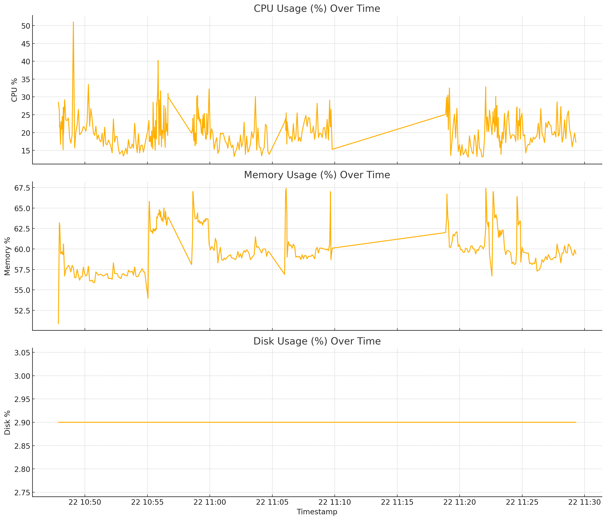

from pathlib import Path

readme_content = """
# 🛠️ Monitoring and Debugging - Ms. Potts MLOps

This document outlines the setup and usage of the **monitoring** and **debugging** modules used in the Ms. Potts AI assistant project. These modules are designed to provide system health insights and help trace and resolve errors efficiently during development and deployment.

---

## 📡 Monitoring

### ✅ Features:
- Periodic system metrics logging (CPU, Memory, Disk)
- Application-level metrics logging (latency, status codes, endpoint access)

### 📦 Module:
`src/ms_potts/utils/monitoring.py`

### 📁 Output Directory:
`metrics/`

### 🧪 How It Works:
Monitoring is enabled via the `ModelMonitor` class.

```python
from utils.monitoring import ModelMonitor
monitor = ModelMonitor(metrics_dir="./metrics")
monitor.start_monitoring(interval=5)  # Logs system stats every 5s
```

### 📊 Example Metric Log:
```json
{
  "timestamp": "2025-05-22T12:00:00",
  "cpu_usage": 25.4,
  "memory_usage": 63.1,
  "disk_usage": 2.9
}
```


### 🧠 Application Metrics Example:
```python
monitor.log_application_metrics({
    "endpoint": "/query",
    "status_code": 200,
    "processing_time_ms": 123.4
})
```

---

## 🐞 Debugging

### ✅ Features:
- Trace every key step and intermediate value
- Logs function calls with input/output
- Saves execution traces and error traces automatically

### 📦 Module:
`src/ms_potts/utils/debugging.py`

### 📁 Output Directory:
`debug_traces/`

### ⚙️ How It Works:
Use the `DebugTracer` to trace functions and capture debug values.

```python
from utils.debugging import DebugTracer, debug_value

tracer = DebugTracer(output_dir="./debug_traces")

@tracer.trace_function
def get_response(...):
    debug_value(query_embedding, "Query Embedding Shape")
```

### 📄 Output Files:
- `query_trace_<timestamp>.json`: for successful traces
- `error_trace_<timestamp>.json`: for failed runs

### 📘 Example Trace Log:
```json
{
  "function": "get_response",
  "step": "intent_classification",
  "value": "Meal-Logging"
}
```

---

## 📌 Deliverables Checklist

| Component               | Path                                      | Status |
|------------------------|-------------------------------------------|--------|
| Monitoring module      | `src/ms_potts/utils/monitoring.py`        | ✅     |
| Debugging module       | `src/ms_potts/utils/debugging.py`         | ✅     |
| Metrics samples        | `metrics/`                                 | ✅     |
| Trace logs             | `debug_traces/`                            | ✅     |
| This documentation     | `README_MONITORING_DEBUGGING.md`          | ✅     |

---

## 📎 Notes
- Logging integrates with `EnhancedLogger` for rich console + file output.
- Future enhancements can include Prometheus/Grafana integration for live dashboards.

---

🧪 **Tested & Verified:** Locally and within Docker container during API queries.
"""
