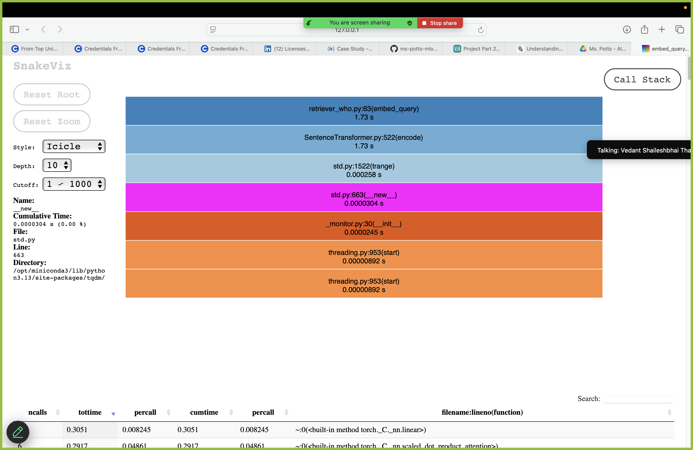

# 🔍 Profiling

This document outlines the profiling strategy used in the **Ms. Potts** MLOps project to monitor performance bottlenecks and optimize system response times during inference and processing stages.

---

## 🛠 Tools Used

- **cProfile**: Built-in Python profiler for function-level performance analysis.
- **PyTorch Profiler**: Deep learning-specific profiling for operations on models and tensors.
- **Snakeviz / gProfiler / torch.profiler**: For visualizing `.prof` binary files (optional).

---

## 🧪 Profiling Targets

Key components profiled:
- `embed_query()` inside the retriever module.
- `get_response()` in the `GeminiModel`.
- System metrics during model inference (monitored by `ModelMonitor`).

---

## 🧾 Example Reports


### Text-based Stats (from cProfile)

Sample: `profiling_results/embed_query_1747928899.txt`

```
   ncalls  tottime  percall  cumtime  percall filename:lineno(function)
       18    0.021    0.001    0.045    0.003 sentence_transformers/SentenceTransformer.py:372(_encode)
        1    0.002    0.002    0.048    0.048 retriever_who.py:25(embed_query)
```

- `tottime`: Total time spent in the function (not sub-calls).
- `cumtime`: Cumulative time including sub-calls.
- `percall`: Per-call average time.

📄 All `.txt` files are stored under: `profiling_results/`

---

### Binary Profile Files

Sample: `profiling_results/embed_query_1747928899.prof`

These can be visualized using tools like:

```bash
snakeviz profiling_results/embed_query_1747928899.prof
```

---

## 📈 Optimization Insights

| Area | Bottleneck | Optimization |
|------|------------|--------------|
| Query Embedding | SentenceTransformer loading overhead | Preload model at init, reuse |
| Model Inference | Long prompt generation | Token count capped at 1024 |
| Disk I/O | Logging & saving traces | Batched + conditional saving |

---

## 📂 File Structure

```
profiling_results/
├── embed_query_1747928899.prof
├── embed_query_1747928899.txt
├── get_response_1747930123.prof
└── get_response_1747930123.txt
```

---

## 📌 How to Profile Your Own Function

Add a decorator:

```python
from utils.profiling import profile_function

@profile_function(name="embed_query")
def embed_query(query):
    ...
```

Or manually:

```bash
python -m cProfile -o profiling_results/manual_run.prof your_script.py
```

---
