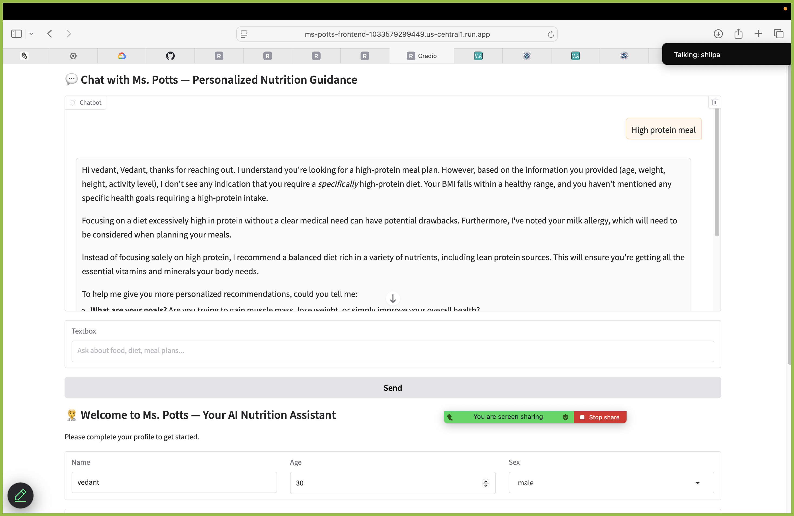

# Ms. Potts - AI-powered Nutrition Assistant

---


Ms. Potts is an AI-powered nutrition chatbot that provides meal recommendations, dietary advice, and meal logging, personalized based on user profile information. This project follows MLOps best practices with comprehensive monitoring, experiment tracking, and configuration management.

## DEMO:
[GCP APP LINK](https://ms-potts-frontend-1033579299449.us-central1.run.app)

### Step-1 User Profile Creation


### Step-2 User query for Nutrition Advice


## Features

- Retrieval-Augmented Generation (RAG) Pipeline
- Intent Classification
- Personalized Meal Planning
- Meal Logging
- Gemini API Integration
- MLOps Best Practices (Phase 2)

## Tech Stack

- FastAPI (Backend API)
- Gradio (Frontend UI)
- Sentence-Transformers
- Google Gemini API
- Docker Containerization with Docker Compose
- MLflow Experiment Tracking
- Hydra Configuration Management
- Enhanced Logging and Monitoring

## Phase 2 MLOps Enhancements

### 1. Containerization with Docker

The project has been containerized using separate Dockerfiles for frontend and backend, orchestrated with Docker Compose:

```bash
# Build and run with Docker Compose
docker-compose up --build

# Access the frontend at http://localhost:7860
# Access the backend at http://localhost:8080
```

The Dockerfiles include:
- Python 3.10 base image
- All required dependencies
- Proper directory structure
- Environment variable configuration
- Separate entry points for frontend and backend

### 2. Monitoring & Debugging

📊 **Monitoring & Debugging Documentation**
For setup, examples, and troubleshooting guides, [click here](./README-MONITORING-DEBUGGING.md).

Comprehensive monitoring and debugging tools have been integrated:

```python
# Initialize monitoring
from utils.monitoring import ModelMonitor
monitor = ModelMonitor(metrics_dir="./metrics")
monitor.start_monitoring(interval=5)

# Log model metrics
monitor.log_model_metrics({
    "latency_ms": latency_ms,
    "tokens_generated": tokens_generated
})

# Initialize debugging
from utils.debugging import DebugTracer, debug_value
tracer = DebugTracer(output_dir="./debug_traces")

# Trace function calls
@tracer.trace_function
def process_query(query):
    # Function code
    return result
```

Monitoring metrics include:
- System resources (CPU, memory, disk usage)
- Model performance (latency, token count)
- Application metrics (request processing time, endpoint usage)

### 3. Profiling & Optimization
For Profiling details and Results, [click here](./README-PROFILING.md).

Profiling tools have been added to identify performance bottlenecks:

```python
# Initialize profilers
from utils.profiling import CodeProfiler, MLProfiler
code_profiler = CodeProfiler(output_dir="./profiling_results")
ml_profiler = MLProfiler(output_dir="./ml_profiling_results")

# Profile functions
@code_profiler.profile_function
def embed_query(query):
    # Function code
    return embedding

# Profile specific code blocks
with code_profiler.profile_block("similarity_search"):
    similarities = calculate_similarities()
```

Profiling results are saved to:
- `./profiling_results/` for Python code profiling
- `./ml_profiling_results/` for ML model profiling

### 4. Experiment Tracking with MLflow
For Profiling details and Results, [click here](./README-EXPERIMENT_TRACKING.md).

MLflow has been integrated for experiment tracking:

```bash
# Start the MLflow UI
mlflow ui

# Access the UI at http://localhost:5000
```

The application automatically logs:
- Model parameters (embedding model, similarity threshold)
- Performance metrics (retrieval time, response time)
- Query and response data
- Model artifacts

### 5. Enhanced Logging
For Logging Details, [click here](./README-LOGGING.md).
Rich, structured logging has been implemented:

```python
# Initialize enhanced logger
from utils.enhanced_logging import EnhancedLogger, log_with_context
enhanced_logger = EnhancedLogger(
    name="ms_potts",
    level="info",
    log_dir="./logs",
    console_output=True,
    file_output=True,
    json_output=True,
    rich_formatting=True
)
logger = enhanced_logger.get_logger()

# Context-aware logging
log_with_context(
    logger,
    "info",
    "Processing query request",
    request_id=request_id,
    query=query
)
```

Logs are stored in `./logs/` with detailed context information.

### 6. Configuration Management with Hydra
For Configuration Managment, [click here](./README-CONFIGURATION_MANAGEMENT.md).
Hydra has been integrated for hierarchical configuration management:

```bash
# Run with default (production) configuration
python -m src.ms_potts.main

# Run with development configuration
python -m src.ms_potts.main +mode=development

# Override specific parameters
python -m src.ms_potts.main model.batch_size=64 app.port=9000
```

Configuration files are organized in the `conf/` directory:
- `config.yaml`: Main configuration
- `development.yaml`: Development environment overrides
- `production.yaml`: Production environment overrides
- `testing.yaml`: Testing environment overrides

## Setup Instructions

### Prerequisites
- Python 3.10+
- Docker and Docker Compose (for containerized deployment)

### Local Installation

1. Clone this repository:
```bash
git clone https://github.com/Vedant-1012/ms-potts-mlops.git
cd ms-potts-mlops
```

2. Create a virtual environment:
```bash
python -m venv venv
source venv/bin/activate  # On Windows: venv\Scripts\activate
```

3. Install dependencies:
```bash
pip install -r requirements.txt
```

4. Create a `.env` file with your Gemini API Key:
```
GEMINI_API_KEY=your_api_key_here
```

5. Run the application:
```bash
python src/ms_potts/main.py  # Backend
python src/ms_potts/interface.py  # Frontend
```

6. Access the frontend at `http://localhost:7860` and the API at `http://localhost:8080`

### Docker Deployment

1. Build and run with Docker Compose:
```bash
docker-compose up --build
```

2. Access the frontend at `http://localhost:7860` and the API at `http://localhost:8080`

## Project Organization
```markdown
    ├── LICENSE
    ├── Makefile           <- Makefile with commands like `make data` or `make train`
    ├── README.md          <- The top-level README for developers using this project.
    ├── data
    │   ├── external       <- Data from third party sources.
    │   ├── interim        <- Intermediate data that has been transformed.
    │   ├── processed      <- The final, canonical data sets for modeling.
    │   └── raw            <- The original, immutable data dump.
    │
    ├── docs               <- A default Sphinx project; see sphinx-doc.org for details
    │
    ├── models             <- Trained and serialized models, model predictions, or model summaries
    │
    ├── notebooks          <- Jupyter notebooks. Naming convention is a number (for ordering),
    │                         the creator's initials, and a short `-` delimited description, e.g.
    │                         `1.0-jqp-initial-data-exploration`.
    │
    ├── references         <- Data dictionaries, manuals, and all other explanatory materials.
    │
    ├── reports            <- Generated analysis as HTML, PDF, LaTeX, etc.
    │   └── figures        <- Generated graphics and figures to be used in reporting
    │
    ├── requirements.txt   <- The requirements file for reproducing the analysis environment, e.g.
    │                         generated with `pip freeze > requirements.txt`
    │
    ├── setup.py           <- makes project pip installable (pip install -e .) so src can be imported
    ├── src                <- Source code for use in this project.
    │   ├── __init__.py    <- Makes src a Python module
    │   │
    │   ├── data           <- Scripts to download or generate data
    │   │   └── make_dataset.py
    │   │
    │   ├── features       <- Scripts to turn raw data into features for modeling
    │   │   └── build_features.py
    │   │
    │   ├── models         <- Scripts to train models and then use trained models to make
    │   │   │                 predictions
    │   │   ├── predict_model.py
    │   │   └── train_model.py
    │   │
    │   └── visualization  <- Scripts to create exploratory and results oriented visualizations
    │       └── visualize.py
    │
    ├── docker-compose.yml <- Docker Compose configuration
    ├── Dockerfile.backend <- Dockerfile for the backend service
    ├── Dockerfile.frontend <- Dockerfile for the frontend service
    │
    ├── conf               <- Hydra configuration files
    │   ├── config.yaml    <- Main configuration
    │   ├── development.yaml <- Development environment overrides
    │   ├── production.yaml <- Production environment overrides
    │   └── testing.yaml   <- Testing environment overrides
    │
    ├── mlruns            <- MLflow experiment tracking data
    │
    ├── logs              <- Application logs
    │
    ├── metrics           <- Monitoring metrics
    │
    ├── profiling_results <- Code profiling results
    │
    └── tox.ini            <- tox file with settings for running tox; see tox.readthedocs.io
```

## MLOps Best Practices

This project follows these MLOps best practices:

1. **Containerization**: Docker and Docker Compose for consistent deployment
2. **Monitoring**: Tracking system and application metrics
3. **Debugging**: Tracing and value inspection tools
4. **Profiling**: Performance analysis for Python and ML code
5. **Experiment Tracking**: MLflow for tracking parameters, metrics, and artifacts
6. **Enhanced Logging**: Rich, structured logging with context
7. **Configuration Management**: Hydra for hierarchical configuration
8. 

## Team

- [Vedant Thakkar](https://github.com/Vedant-1012)
- [Shilpa Musale](https://github.com/shilpamusale) 


## License

MIT License

--------

<p><small>Project based on the <a target="_blank" href="https://drivendata.github.io/cookiecutter-data-science/">cookiecutter data science project template</a>. #cookiecutterdatascience</small></p>
